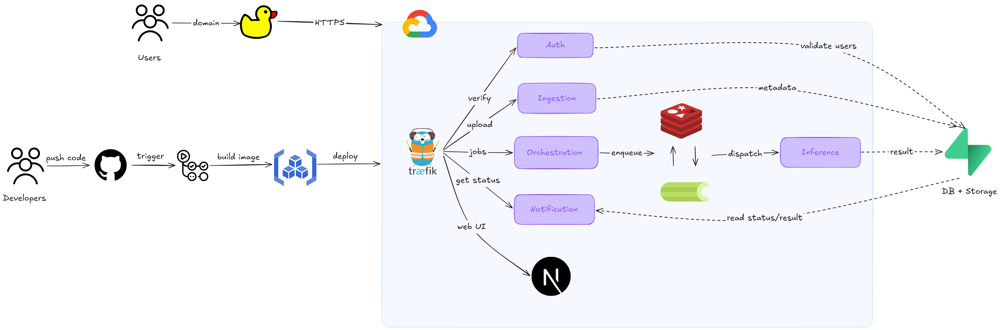
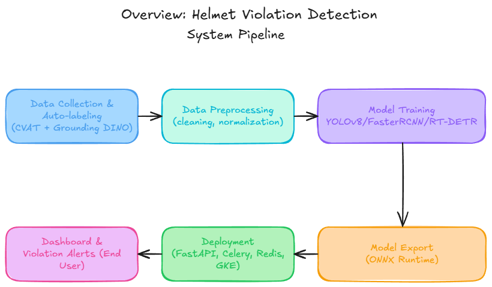
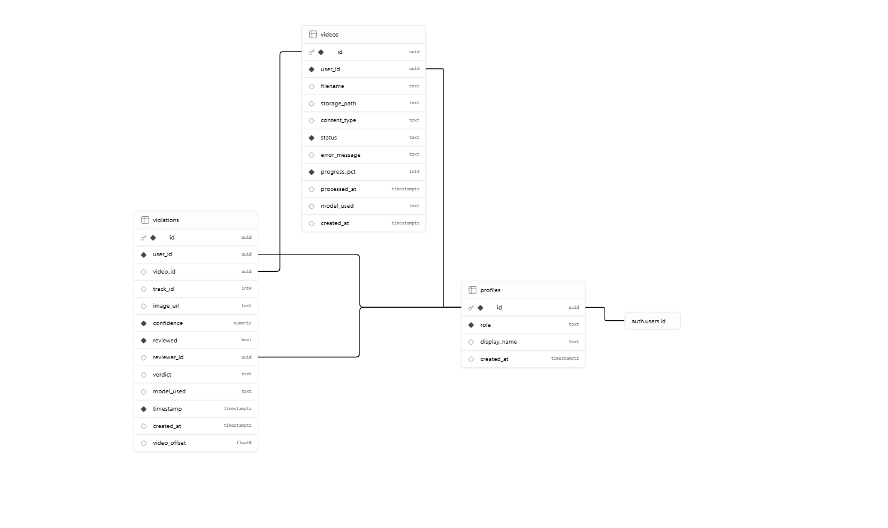

# Helmet Violation Detection

An end-to-end traffic safety system for detecting motorcycle riders without helmets from uploaded videos and live camera streams. The project combines object detection models, asynchronous video processing, real-time WebSocket streaming, Supabase-backed audit storage, and a Next.js operator dashboard.

Live deployment: [https://dtdat-nthv.duckdns.org/](https://dtdat-nthv.duckdns.org/)

Project reports: [Google Drive report folder](https://drive.google.com/drive/folders/1Gsc2ARZR0iUiFUlZCpQ8hty4eD_0UUJA?usp=drive_link)

## Overview

The system helps operators monitor helmet violations by:

- Detecting motorcycles, riders, helmets, and non-helmet cases in video frames.
- Associating riders with motorcycles using tracking and bounding-box overlap heuristics.
- Generating cropped proof images for each detected violation.
- Storing videos, violation metadata, and proof images through Supabase.
- Streaming annotated live camera frames to the dashboard over WebSockets.
- Broadcasting real-time alerts and job status updates.
- Supporting multiple detector families: YOLO, RT-DETR, and Faster R-CNN.

## System Architecture



The application is organized as a containerized microservice system:

- `frontend`: Next.js dashboard for login, upload, live monitoring, and violation review.
- `api-gateway`: Traefik gateway that exposes public HTTP and WebSocket routes.
- `auth`: Authentication and profile authorization service.
- `ingestion`: Video upload and video/job metadata APIs.
- `inference`: Celery worker that runs ONNX Runtime inference and violation logic.
- `realtime`: WebSocket camera stream service using the same inference code path.
- `notification`: Redis-backed WebSocket notification service.
- `dashboard`: Violation query and auditing APIs.
- `orchestration`: Background cleanup and retention jobs.
- `redis`: Queue and pub/sub broker for async processing and real-time events.
- `supabase`: External Postgres, Auth, Storage, Realtime, and Row Level Security layer.

## System Build Workflow



The project was built through the workflow shown above:

1. Collect and auto-label traffic data using CVAT and Grounding DINO.
2. Clean, normalize, and prepare the dataset for model experiments.
3. Train and compare YOLOv8, Faster R-CNN, and RT-DETR detectors.
4. Export selected models to ONNX for runtime inference.
5. Deploy backend services with FastAPI, Celery, Redis, and GKE.
6. Expose the dashboard and violation alert experience to end users.

At runtime, uploaded videos and live camera streams pass through the inference services, which run the selected ONNX model, associate riders with motorcycles, create violation proof crops, and store audit records in Supabase.

## Data Layer



Supabase provides:

- Auth for operator/admin access.
- Postgres tables for videos, violations, profiles, and related audit data.
- Storage buckets for uploaded videos and violation proof crops.
- Row Level Security policies for role-aware data access.
- Realtime support where applicable.

The canonical database migrations live in [`supabase/migrations`](supabase/migrations).

## Model Artifacts

Trained model artifacts are published on Hugging Face:

[https://huggingface.co/dtdat1234/helmet-violation-detection-models](https://huggingface.co/dtdat1234/helmet-violation-detection-models)

Runtime ONNX weights should be placed in [`backend/inference/weights`](backend/inference/weights):

- `yolo_best.onnx`
- `rtdetr_best.onnx`
- `fasterrcnn_best.onnx`

Training checkpoints and training-oriented artifacts are documented in [`models/checkpoints/README.md`](models/checkpoints/README.md). The training code under [`models`](models) supports YOLO, RT-DETR, and Faster R-CNN experiments, including Ray Tune workflows.

By default, the Docker Compose stack can run with stub inference. To enable real inference, set `USE_STUB_INFERENCE=false`, add the ONNX files above, and rebuild the inference image.

## Tech Stack

- Frontend: Next.js 16, React 19, TypeScript, Tailwind CSS, Supabase client, React Query.
- Backend: Python 3.13, FastAPI, Celery, Redis, ONNX Runtime, OpenCV.
- Database and storage: Supabase Postgres, Auth, Storage, RLS policies.
- Deployment: Docker Compose locally; GKE Autopilot, Artifact Registry, Traefik, cert-manager, DuckDNS, and GitHub Actions for cloud deployment.

## Local Development

Prerequisites:

- Docker and Docker Compose.
- Python 3.13+.
- `uv`.
- Node.js 18+ for frontend-only development.
- Supabase project credentials for full authenticated workflows.

Create local environment variables:

```bash
cp .env.example .env
```

Start the full local stack:

```bash
docker compose up --build
```

Local endpoints:

- Frontend: [http://localhost:3000](http://localhost:3000)
- API gateway: [http://localhost:8000](http://localhost:8000)

Seed demo users:

```bash
uv sync
uv run backend/seed_users.py
```

Default demo accounts:

- Operator: `operator@system.com` / `password123`
- Admin: `admin@system.com` / `password123`

## Testing

Backend test suites:

```powershell
$env:PYTHONPATH="backend"
uv run pytest backend/ingestion/ backend/inference/ backend/notification/ backend/dashboard/ backend/orchestration/
```

Frontend checks:

```bash
cd frontend
npm run lint
npm run build
```

Deployment validation scripts are available in [`deploy/scripts/win`](deploy/scripts/win), including manifest validation, exposure checks, smoke tests, health inspection, and rollback helpers.

## Deployment

The public deployment is available at:

[https://dtdat-nthv.duckdns.org/](https://dtdat-nthv.duckdns.org/)

Google Cloud deployment is designed for a cost-controlled GKE Autopilot cluster in `asia-southeast1` with:

- One Traefik public LoadBalancer entrypoint.
- DuckDNS and Let's Encrypt TLS via cert-manager.
- Artifact Registry images tagged by commit SHA.
- GCP Secret Manager and Workload Identity.
- In-cluster Redis StatefulSet.
- GitHub Actions CI/CD.

Primary deployment documentation:

- [`docs/deployment/google-cloud.md`](docs/deployment/google-cloud.md)
- [`docs/deployment/GCP Deployment Setup.md`](docs/deployment/GCP%20Deployment%20Setup.md)
- [`docs/deployment/public-endpoint.md`](docs/deployment/public-endpoint.md)
- [`docs/deployment/rollback-and-recovery.md`](docs/deployment/rollback-and-recovery.md)
- [`specs/004-deploy-google-cloud/plan.md`](specs/004-deploy-google-cloud/plan.md)

## Documentation

- Documentation index: [`docs/README.md`](docs/README.md)
- Project reports: [Google Drive report folder](https://drive.google.com/drive/folders/1Gsc2ARZR0iUiFUlZCpQ8hty4eD_0UUJA?usp=drive_link)
- Hugging Face model repository: [dtdat1234/helmet-violation-detection-models](https://huggingface.co/dtdat1234/helmet-violation-detection-models)
- Backend notes: [`backend/README.md`](backend/README.md)
- Inference weight notes: [`backend/inference/weights/README.md`](backend/inference/weights/README.md)
- Model checkpoint notes: [`models/checkpoints/README.md`](models/checkpoints/README.md)
