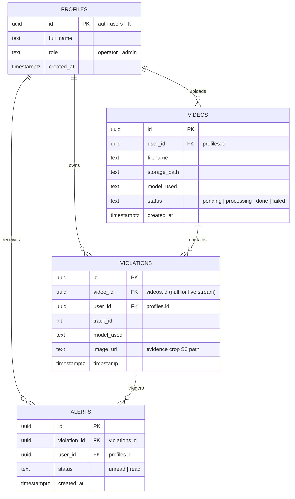

# Data Models & Schemas

**Feature**: Helmet Violation Detection System
**Branch**: `001-detect-helmet-violations`

---

## 1. Domain Database Schemas

We implement logical database schemas in Supabase Postgres, separating concerns by service boundaries where feasible.



### 1.1 Auth Schema
Manages user profiles and permissions. Enforces access controls through roles (`operator` vs. `admin`).

```sql
-- Schema: auth_service
CREATE TABLE IF NOT EXISTS public.profiles (
  id uuid PRIMARY KEY REFERENCES auth.users(id) ON DELETE CASCADE,
  full_name text,
  role text DEFAULT 'operator' CHECK (role IN ('operator', 'admin')),
  created_at timestamptz DEFAULT now() NOT NULL
);

-- RLS Policies
ALTER TABLE public.profiles ENABLE ROW LEVEL SECURITY;

CREATE POLICY "Profiles are viewable by everyone" 
  ON public.profiles FOR SELECT USING (true);

CREATE POLICY "Users can update their own profiles" 
  ON public.profiles FOR UPDATE USING (auth.uid() = id);
```

### 1.2 Ingestion Schema
Manages uploaded video metadata and ingestion statuses.

```sql
-- Schema: ingestion_service
CREATE TABLE IF NOT EXISTS public.videos (
  id uuid PRIMARY KEY DEFAULT gen_random_uuid(),
  user_id uuid REFERENCES public.profiles(id) ON DELETE SET NULL,
  filename text NOT NULL,
  storage_path text NOT NULL,
  model_used text NOT NULL CHECK (model_used IN ('yolo', 'rtdetr', 'fasterrcnn')),
  status text DEFAULT 'pending' CHECK (status IN ('pending', 'processing', 'done', 'failed')),
  created_at timestamptz DEFAULT now() NOT NULL
);

-- RLS Policies
ALTER TABLE public.videos ENABLE ROW LEVEL SECURITY;

CREATE POLICY "Operators view own videos" 
  ON public.videos FOR SELECT 
  USING (auth.uid() = user_id OR EXISTS (
    SELECT 1 FROM public.profiles WHERE id = auth.uid() AND role = 'admin'
  ));

CREATE POLICY "Operators insert own videos" 
  ON public.videos FOR INSERT 
  WITH CHECK (auth.uid() = user_id);
```

### 1.3 Violation & Inference Schema
Contains information about verified helmet violations and tracking details.

```sql
-- Schema: inference_service
CREATE TABLE IF NOT EXISTS public.violations (
  id uuid PRIMARY KEY DEFAULT gen_random_uuid(),
  video_id uuid REFERENCES public.videos(id) ON DELETE SET NULL,
  user_id uuid REFERENCES public.profiles(id) ON DELETE SET NULL,
  track_id int NOT NULL,
  model_used text NOT NULL CHECK (model_used IN ('yolo', 'rtdetr', 'fasterrcnn')),
  image_url text NOT NULL,
  timestamp timestamptz DEFAULT now() NOT NULL
);

-- RLS Policies
ALTER TABLE public.violations ENABLE ROW LEVEL SECURITY;

CREATE POLICY "Operators view own violations" 
  ON public.violations FOR SELECT 
  USING (auth.uid() = user_id OR EXISTS (
    SELECT 1 FROM public.profiles WHERE id = auth.uid() AND role = 'admin'
  ));
```

### 1.4 Notification Schema
Stores in-app alerts generated by violations for operators.

```sql
-- Schema: notification_service
CREATE TABLE IF NOT EXISTS public.alerts (
  id uuid PRIMARY KEY DEFAULT gen_random_uuid(),
  violation_id uuid REFERENCES public.violations(id) ON DELETE CASCADE,
  user_id uuid REFERENCES public.profiles(id) ON DELETE CASCADE,
  status text DEFAULT 'unread' CHECK (status IN ('unread', 'read')),
  created_at timestamptz DEFAULT now() NOT NULL
);

-- RLS Policies
ALTER TABLE public.alerts ENABLE ROW LEVEL SECURITY;

CREATE POLICY "Users view own alerts" 
  ON public.alerts FOR SELECT USING (auth.uid() = user_id);

CREATE POLICY "Users update own alerts to read" 
  ON public.alerts FOR UPDATE USING (auth.uid() = user_id);
```

---

## 2. Storage Buckets (S3-compatible API)

1. **`videos` Bucket**:
   * Path format: `raw/{user_id}/{video_id}/{filename}`
   * Ingestion service writes directly via S3 Multipart upload.
2. **`violations` Bucket**:
   * Path format: `crops/{user_id}/{violation_id}.jpg`
   * Inference service uploads high-resolution JPEG crops of the composite union box.
