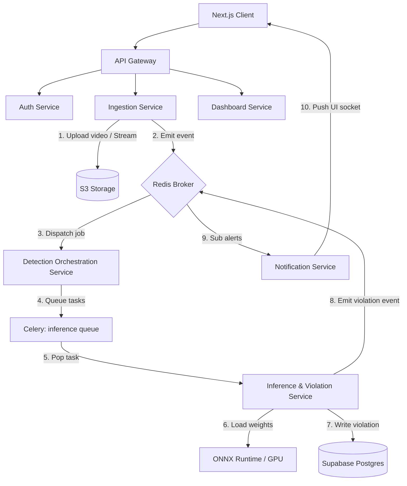
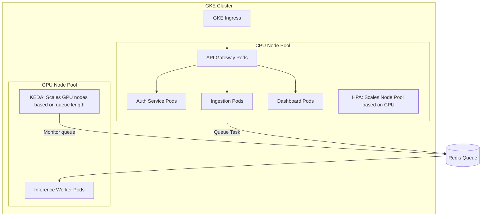

# Research Report: Helmet Violation Detection System Architecture

**Feature**: Helmet Violation Detection System
**Branch**: `001-detect-helmet-violations`

---

## 1. Architectural Overview & Boundaries

To support traffic police officers in high-load operational scenarios without wasting computational resources, the system is designed around a **Microservices Architecture** with **Domain-Driven Design (DDD)** boundaries:

### Microservices Definitions & Domain Boundaries:
1. **API Gateway**: Entry point for all clients. Routes incoming requests, handles rate limiting, and terminates SSL.
2. **Auth Service**: Manages profiles, authentication tokens, and scopes. Exposes gRPC endpoints for synchronous user verification from other services.
3. **Ingestion/Upload Service**: Accepts chunked file uploads for videos, streams frames for live camera monitoring, and writes raw files directly to S3 storage.
4. **Detection Orchestration Service**: Listens for video upload completion events, verifies file integrity, registers video entities, and partitions video chunks to dispatch to the inference queue.
5. **Inference & Violation Service**: Runs as a Celery worker. Ingests video chunks, runs ONNX Runtime models, applies tracking algorithms, filters stationary vehicles, computes composite crops, saves crops to S3, and writes violation rows.
6. **Notification Service**: Subscribes to violation event broker feeds, formats messages according to user language preferences (default Vietnamese, secondary English), and pushes real-time alert updates to Next.js clients over WebSockets.
7. **Query/Dashboard API Service**: Handles paginated queries, statistics computations, and audits for operators/admins. Enforces Row-Level Security (RLS) policies.

---

## 2. In-Depth Technical Decisions & Trade-Offs

### 2.1 Communication Patterns (gRPC vs. Redis Event Broker)
* **Decision**: Synchronous service calls (e.g., auth check, metadata lookup) use **gRPC**. Asynchronous processing events use **Redis Pub/Sub & Celery Message Queue**.
* **Rationale**:
  * **gRPC** uses HTTP/2 multiplexing and Protocol Buffers, providing microsecond-level serialization and low network latency, critical for blocking API requests.
  * **Redis** offers high-throughput, low-overhead pub-sub mechanisms. Decoupling the ingestion pipeline from inference prevents REST endpoint blocking during long video scans.
* **Alternatives Considered**:
  * *REST for all calls*: Rejected due to high overhead of HTTP/1.1 connections and JSON serialization under load.
  * *Kafka for events*: Rejected as it introduces excessive operational complexity for a team that can achieve required throughput using Redis.

### 2.2 Inference Pipeline (ONNX Runtime, Heuristics, Tracking)
* **Decision**: Standardize model weights on **ONNX** and execute them via **ONNX Runtime (with CUDA/TensorRT execution provider)**.
* **Execution Details**:
  * Wrappers load the respective ONNX weight file (`yolo_best.onnx`, `rtdetr_best.onnx`, `fasterrcnn_best.onnx`).
  * Normalizes inputs to standard tensors and performs Non-Maximum Suppression (NMS) in Python using NumPy.
* **Heuristics & Rule-based Logic (No Retraining)**:
  * **Composite Bounding Box Crop**: Given motorbike box $M(x_{m1}, y_{m1}, x_{m2}, y_{m2})$ and violating head box $H(x_{h1}, y_{h1}, x_{h2}, y_{h2})$, the crop box $C$ is computed as the envelope/union of the two bounding boxes:
    $$x_{c1} = \min(x_{m1}, x_{h1}), \quad y_{c1} = \min(y_{m1}, y_{h1})$$
    $$x_{c2} = \max(x_{m2}, x_{h2}), \quad y_{c2} = \max(y_{m2}, y_{h2})$$
    This bounding box $C$ is cropped from the frame using OpenCV and saved to S3.
  * **Stationary Motion Filter**: The `IoUTracker` tracks the displacement of the motorbike bounding box center point over a moving window of 10 frames:
    $$\Delta d = \sqrt{(x_{t} - x_{t-1})^2 + (y_{t} - y_{t-1})^2}$$
    If average displacement $\overline{\Delta d}$ is below a threshold (e.g., 2 pixels/frame), the motorbike is categorized as stationary/parked, and any overlapping `non-helmet` detections are discarded to avoid false-positive alerts.

---

## 3. Infrastructure & Deployment (GCP / GKE Standard)

To minimize GCP costs while maintaining production stability, the system uses a dual GKE node pool scaling strategy:

### 3.1 GKE Node Pools
1. **Default Pool (CPU-only)**: Evaluates light Web, API Gateway, Auth, and Dashboard Pods. Autoscales using standard Horizontal Pod Autoscaler (HPA) based on CPU/Memory usage.
2. **Inference Pool (GPU-enabled)**: Hosts the Inference Service. Uses GCP `nvidia-tesla-t4` or `nvidia-l4` GPU accelerators.
   * **Scale-to-Zero Configuration**: The GPU node pool is configured with `autoscaling` enabled, setting minimum nodes to `0` and maximum nodes to `5`.
   * **Scaling Trigger**: Custom metrics monitoring is configured via **KEDA (Kubernetes Event-driven Autoscaling)**. KEDA monitors the Redis celery queue length. If there are no video processing tasks in the queue, KEDA scales the Inference Worker deployment to 0 replicas, which triggers GKE to scale down the GPU node pool to 0 nodes.

### 3.2 Networking & Traffic Routing
* **Ingress**: GKE Ingress controller mapped to Google Cloud Load Balancing (GCLB).
* **SSL/TLS**: Google-managed SSL certificates configured via `ManagedCertificate` resource.
* **Secrets Management**: Native Kubernetes Secrets injected as environment variables in the pod specifications. Sensitive Supabase passwords and S3 access keys are encrypted at rest.

### 3.3 CI/CD Workflow (GitHub Actions)
1. Developers push code to branch.
2. GitHub Actions runs test suites (`pytest` and `jest`) in parallel.
3. On merge to main, the CI runner executes Docker multi-stage builds for each changed service.
4. Images are tagged with git SHA and pushed to **Google Artifact Registry (GAR)**.
5. Deployments are updated via `kubectl apply` with dynamic image tags, or using a Helm upgrade command.
