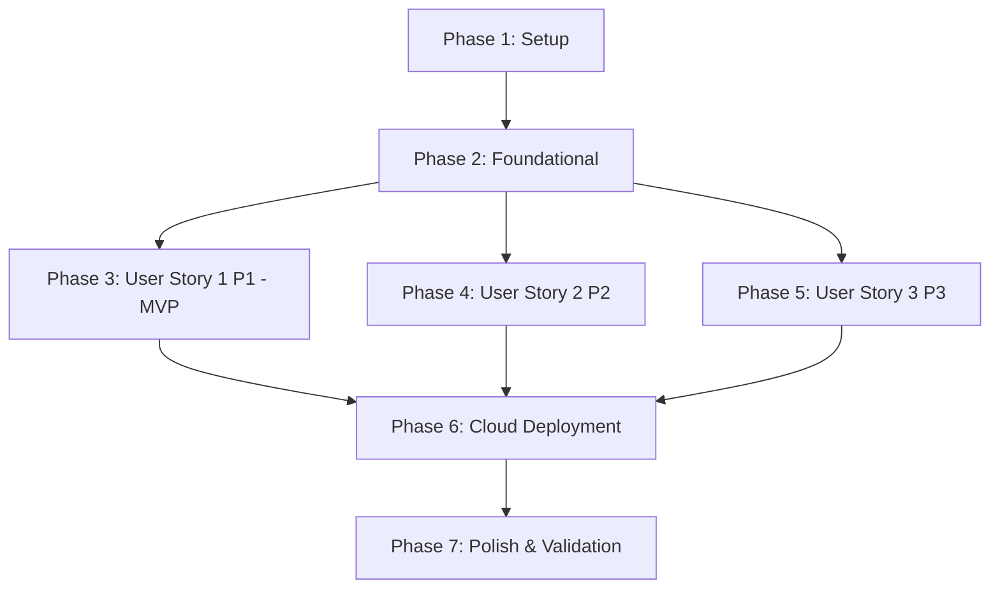

# Tasks: Helmet Violation Detection System

**Input**: Design documents from `specs/001-detect-helmet-violations/`

**Prerequisites**: [plan.md](./plan.md) (required), [spec.md](./spec.md) (required for user stories), [research.md](./research.md), [data-model.md](./data-model.md), [contracts/](./contracts/)

**Organization**: Tasks are grouped by user story to enable independent implementation and testing of each story.

---

## Phase 1: Setup (Shared Infrastructure)

**Purpose**: Project initialization, monorepo setup, and Docker Compose orchestration

- [ ] T001 Initialize monorepo directory layout for backend/auth-service, backend/ingestion-service, backend/orchestration-service, backend/inference-service, backend/notification-service, backend/dashboard-service, backend/api-gateway, and frontend
- [ ] T002 Configure Python 3.13 virtual environments and dependency management via `uv` at root `pyproject.toml`
- [ ] T003 [P] Create multi-stage Dockerfiles for each FastAPI microservice in `backend/auth-service/Dockerfile`, `backend/ingestion-service/Dockerfile`, `backend/orchestration-service/Dockerfile`, `backend/inference-service/Dockerfile`, `backend/notification-service/Dockerfile`, `backend/dashboard-service/Dockerfile`
- [ ] T004 Create local stack Docker Compose configuration at root `docker-compose.yml` defining Traefik Gateway, MinIO (S3 mock), Redis, and database containers

---

## Phase 2: Foundational (Blocking Prerequisites)

**Purpose**: Core communication protocols, gateway routing, and shared database interfaces

**⚠️ CRITICAL**: All tasks in this phase must be completed before starting any user story implementations

- [ ] T005 [P] Configure Traefik routing mappings and rate-limiting middleware in `backend/api-gateway/traefik.yml`
- [ ] T006 [P] Implement base DB connections and migrations for Supabase public profile schemas in `backend/auth-service/src/db.py`
- [ ] T007 [P] Generate gRPC protobuf files and implement synchronous verification call contracts in `backend/auth-service/src/grpc_server.py` and `backend/api-gateway/grpc_client.py`
- [ ] T008 [P] Configure Redis connection pools and task queue structures in `backend/orchestration-service/src/redis_client.py` and `backend/inference-service/src/redis_client.py`

**Checkpoint**: Foundation ready - user story implementation can now begin

---

## Phase 3: User Story 1 - Video Upload & Automated Violation Detection (Priority: P1) 🎯 MVP

**Goal**: Support video uploads and asynchronous model inference on Celery workers

**Independent Test**: Upload a test video via cURL, confirm that `backend/ingestion-service` uploads it to S3 (MinIO), `backend/orchestration-service` queues the task, `backend/inference-service` parses the video using YOLO/Faster R-CNN/RT-DETR weights, extracts composite violation crops, and updates status in the database.

### Tests for User Story 1
- [ ] T009 [P] [US1] Write contract test for video upload REST API in `backend/ingestion-service/tests/test_upload.py`
- [ ] T010 [P] [US1] Write unit tests for ONNX model wrappers using test weights in `backend/inference-service/tests/test_models.py`
- [ ] T011 [P] [US1] Write integration tests for the Celery processing pipeline in `backend/inference-service/tests/test_pipeline.py`

### Implementation for User Story 1
- [ ] T012 [P] [US1] Implement video upload POST endpoint in `backend/ingestion-service/src/main.py`
- [ ] T013 [P] [US1] Implement model loading and prediction wrapper for YOLO, RT-DETR, and Faster R-CNN using ONNX Runtime in `backend/inference-service/src/models/wrapper.py`
- [ ] T014 [US1] Implement composite union crop box calculation logic in `backend/inference-service/src/heuristics/crop.py` (depends on T013)
- [ ] T015 [US1] Implement stationary vehicle filtering logic based on tracking displacement in `backend/inference-service/src/heuristics/motion.py` (depends on T013)
- [ ] T016 [US1] Implement Celery task handler for video decoding, frame-by-frame inference, tracking, crop upload, and violation database writes in `backend/inference-service/src/worker.py` (depends on T014, T015)
- [ ] T017 [US1] Implement video job status dispatcher and lifecycle manager in `backend/orchestration-service/src/lifecycle.py`

**Checkpoint**: Video upload and background pipeline fully functional and independently testable

---

## Phase 4: User Story 2 - Realtime Live Camera Monitoring & Alerting (Priority: P2)

**Goal**: Real-time frame overlay and low-latency notifications via WebSockets

**Independent Test**: Connect to `/ws/camera`, stream frames, and verify that overlay frames are returned under 100ms latency, and alerts are prepended to the feed.

### Tests for User Story 2
- [ ] T018 [P] [US2] Write unit tests for live stream WebSocket connections in `backend/ingestion-service/tests/test_websocket.py`
- [ ] T019 [P] [US2] Write integration tests for real-time notification push channels in `backend/notification-service/tests/test_websocket.py`

### Implementation for User Story 2
- [ ] T020 [US2] Implement WebSocket server and frame piping to Redis in `backend/ingestion-service/src/websocket.py`
- [ ] T021 [US2] Implement real-time frame annotation overlay drawing in `backend/ingestion-service/src/annotate.py`
- [ ] T022 [US2] Implement notification event subscriber in `backend/notification-service/src/main.py`
- [ ] T023 [US2] Implement alert message formatter supporting Vietnamese (default) and English translation toggles in `backend/notification-service/src/i18n.py`

**Checkpoint**: Live streaming WebSockets and real-time alerts function concurrently with Story 1

---

## Phase 5: User Story 3 - Violation Evidence Management & Auditing (Priority: P3)

**Goal**: Dashboard query, RLS filtration, and manual verification toggle

**Independent Test**: Query the database using admin versus operator credentials, verify RLS separation, toggle a violation's status (Approved/Dismissed), and confirm raw video deletion after 3 days.

### Tests for User Story 3
- [ ] T024 [P] [US3] Write contract test for dashboard query API in `backend/dashboard-service/tests/test_queries.py`
- [ ] T025 [P] [US3] Write integration tests for Supabase RLS database policies in `backend/dashboard-service/tests/test_rls.py`

### Implementation for User Story 3
- [ ] T026 [P] [US3] Implement gRPC token verification middleware in `backend/dashboard-service/src/middleware.py`
- [ ] T027 [US3] Implement paginated query endpoint supporting date and model filters in `backend/dashboard-service/src/queries.py`
- [ ] T028 [US3] Implement Next.js query views, image crop viewers, and language selector in `frontend/src/app/dashboard/page.tsx`
- [ ] T029 [US3] Implement 3-day raw video retention deletion daemon in `backend/orchestration-service/src/retention.py`

**Checkpoint**: Administration auditing dashboard and RLS policies active

---

## Phase 6: Cloud Deployment & Infrastructure Setup

**Purpose**: Container deployment, GKE scaling, and secrets mapping

- [ ] T030 [P] Configure Kubernetes deployment, service, ingress, and secrets manifests in `k8s/base/`
- [ ] T031 [P] Create Helm charts supporting scale-to-zero settings for GPU node pools in `k8s/helm-chart/`
- [ ] T032 Configure KEDA autoscaling rules based on Celery Redis queue length in `k8s/base/keda-autoscaler.yaml`
- [ ] T033 Create GitHub Actions CI/CD workflows building per-service multi-stage Docker images to Artifact Registry in `.github/workflows/deploy.yaml`

---

## Phase 7: Polish & Cross-Cutting Concerns

**Purpose**: Performance optimization, structured logs, and validation

- [ ] T034 [P] Add structured JSON logging and metrics hooks to all Python microservices
- [ ] T035 [P] Update local setup documentation in `specs/001-detect-helmet-violations/quickstart.md`
- [ ] T036 Perform manual end-to-end load tests on Traefik API Gateway and Celery inference queues

---

## Dependencies & Execution Order

### Phase Dependencies



### Parallel Execution Examples (Phase 3 - User Story 1)

```bash
# Developer 1 runs test tasks in parallel:
Task: "T009 [P] [US1] Write contract test for video upload REST API in backend/ingestion-service/tests/test_upload.py"
Task: "T010 [P] [US1] Write unit tests for ONNX model wrappers using test weights in backend/inference-service/tests/test_models.py"

# Developer 2 writes isolated code in parallel:
Task: "T012 [P] [US1] Implement video upload POST endpoint in backend/ingestion-service/src/main.py"
```

---

## Implementation Strategy

### MVP First (User Story 1 Only)
1. Complete **Phase 1: Setup** (folders, packages, local docker compose).
2. Complete **Phase 2: Foundational** (gateway routes, database migrations).
3. Complete **Phase 3: User Story 1** (inference worker, async Celery queue, S3 upload).
4. Run validation test suite to confirm MVP is working.

### Incremental Delivery
1. Add **User Story 2** $\rightarrow$ WebSockets live monitoring at roadside checkpoints.
2. Add **User Story 3** $\rightarrow$ Admin/Supervisor logs audits with RLS privacy protection.
3. Deploy to GKE Standard and configure KEDA GPU scale-to-zero parameters.
