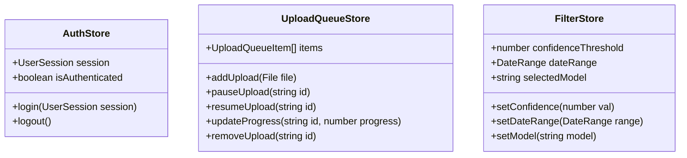

# Frontend Data Models & Zustand States

**Feature**: Detection Pipeline Frontend
**Branch**: `002-detection-pipeline-frontend`

---

## 1. Zustand Local UI States

We model the client-side states in Zustand using TypeScript interfaces to maintain full type-safety.



### 1.1 Auth Store (`store/useAuthStore.ts`)
Manages the active session profile and authentication states.

```typescript
export interface UserSession {
  userId: string;
  fullName: string;
  role: "admin" | "operator";
  accessToken: string | null; // In-memory only
}

interface AuthState {
  session: UserSession | null;
  isAuthenticated: boolean;
  login: (session: UserSession) => void;
  logout: () => void;
}
```

### 1.2 Upload Queue Store (`store/useUploadStore.ts`)
Tracks files added, progress percentages, and TUS upload instances.

```typescript
import { Upload } from "tus-js-client";

export interface UploadQueueItem {
  id: string;
  fileName: string;
  fileSize: number;
  progress: number; // 0 - 100
  status: "uploading" | "paused" | "completed" | "failed";
  error?: string;
  tusInstance?: Upload;
}

interface UploadQueueState {
  items: UploadQueueItem[];
  addUpload: (id: string, name: string, size: number, tus: Upload) => void;
  updateProgress: (id: string, progress: number) => void;
  setStatus: (id: string, status: UploadQueueItem["status"], error?: string) => void;
  pauseUpload: (id: string) => void;
  resumeUpload: (id: string) => void;
  clearCompleted: () => void;
}
```

### 1.3 Filter Store (`store/useFilterStore.ts`)
Stores global query filters and video timeline configurations.

```typescript
export interface DateRange {
  startDate: string; // ISO format
  endDate: string;   // ISO format
}

interface FilterState {
  confidenceThreshold: number; // 0.0 - 1.0 (defaults to 0.5)
  dateRange: DateRange;
  selectedModel: "all" | "yolo" | "rtdetr" | "fasterrcnn";
  selectedStatus: "all" | "pending" | "approved" | "dismissed";
  setConfidenceThreshold: (val: number) => void;
  setDateRange: (range: DateRange) => void;
  setSelectedModel: (model: FilterState["selectedModel"]) => void;
  setSelectedStatus: (status: FilterState["selectedStatus"]) => void;
  resetFilters: () => void;
}
```

---

## 2. API Contract Typings (OpenAPI Integration)

The generated OpenAPI TypeScript schemas (`services/api.ts`) map directly to these entity models:

```typescript
export interface DetectionJob {
  jobId: string; // UUID
  fileName: string;
  modelUsed: "yolo" | "rtdetr" | "fasterrcnn";
  status: "pending" | "processing" | "done" | "failed";
  createdAt: string; // ISO datetime
  completedAt?: string; // ISO datetime
}

export interface ViolationOverlay {
  id: string; // UUID
  timestamp: number; // Seconds from video start
  bbox: [number, number, number, number]; // [x1, y1, x2, y2]
  confidence: number; // 0.0 - 1.0
  label: "non-helmet" | "helmet" | "motorbike";
  isFlagged: boolean;
}

export interface SystemHealth {
  service: string;
  status: "healthy" | "degraded" | "down";
  latencyMs: number;
}
```
