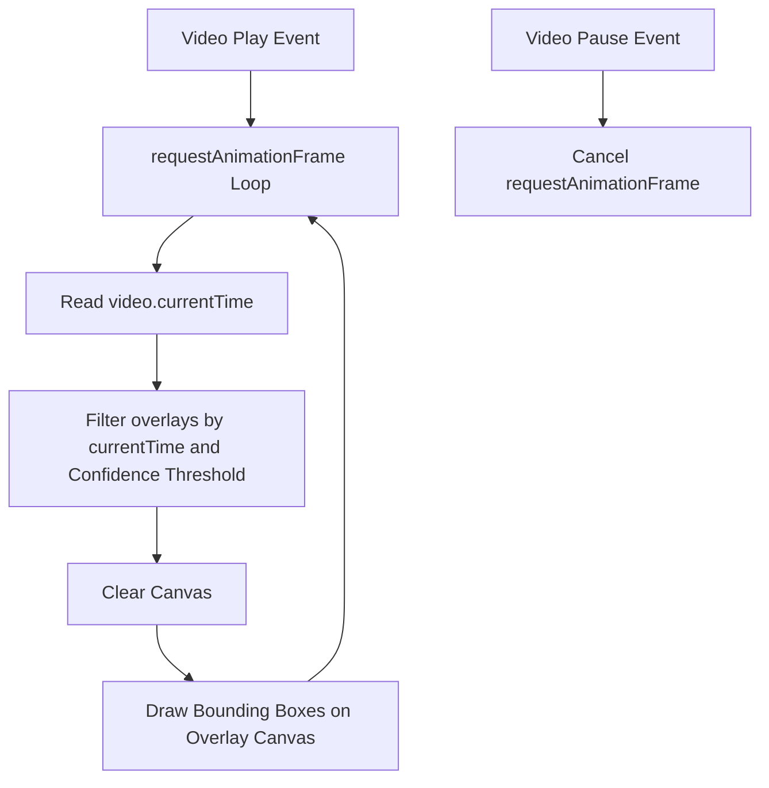
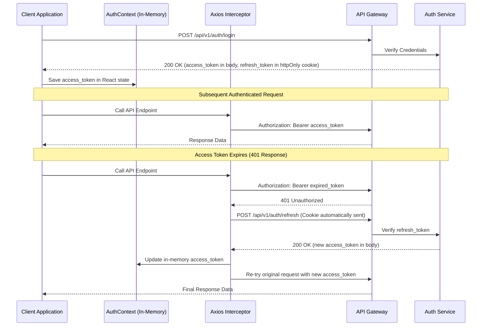
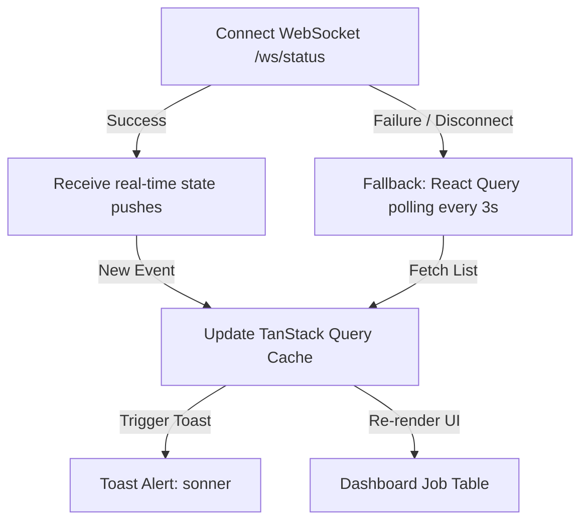

# Research Report: Frontend Architecture & Performance

**Feature**: Detection Pipeline Frontend
**Branch**: `002-detection-pipeline-frontend`

---

## 1. State Management & Data Fetching Separation

To keep UI performance high, the frontend decouples **Server State** from **Local Client UI State**:

```mermaid
graph TD
    subgraph Client State: Zustand
        AuthSession[Auth Session Store]
        UploadQueue[Upload Queue Store]
        FilterState[Dashboard & Video Slider Filters]
    end

    subgraph Server State: TanStack Query
        InferenceStatus[Job Status Polling/WS cache]
        DashboardAggs[Dashboard Analytics Cache]
        ViolationList[Violations Query Cache]
    end

    subgraph UI Components
        UploadWidget[Upload Dropzone UI] -->|Update progress| UploadQueue
        VideoOverlay[Video Overlay Layer] -->|Read filters| FilterState
        VideoOverlay -->|Read violations| ViolationList
    </div>
```

### 1.1 Server State: TanStack Query (React Query)
* **Usage**: Handles caching, automatic retries, background re-validation, and loading states for REST API calls (job lists, violation listings, analytics).
* **Workload-split Status**: When WebSockets are disconnected, TanStack Query falls back to short-interval polling (e.g., every 3 seconds) to track `DetectionJob` state transitions (`pending` $\rightarrow$ `processing` $\rightarrow$ `done`/`failed`).

### 1.2 Local UI State: Zustand
* **Usage**: Lightweight, boilerplate-free state manager. Tracks local-only interactions:
  * **TUS Upload Queue**: Files actively uploading, progress percentages, and pause/resume states.
  * **Interactive Results Filters**: Value of the confidence threshold slider and selected timestamp filter.
  * **Auth profile**: Logged-in user information.
* **Why not Context API**: Context re-renders the entire children tree on state changes, causing frame drops on the video canvas overlay and slider interactions. Zustand uses selector-based subscriptions to prevent unnecessary re-renders.

---

## 2. Interactive Video Overlay & Synchronization

To render bounding boxes on the video player with less than 50ms drift (SC-002), the frontend uses a canvas overlay layer synced to the HTML5 video element's `currentTime`.



### Canvas Overlay Synchronization Mechanics:
1. An HTML5 `<canvas>` is absolutely positioned directly on top of the `<video>` container, matching its exact aspect ratio.
2. When the video starts playing, we kick off a rendering loop using `requestAnimationFrame`:
   ```typescript
   function renderLoop() {
     if (video.paused || video.ended) return;
     drawOverlays();
     requestAnimationFrame(renderLoop);
   }
   ```
3. Inside `drawOverlays`, the system reads `video.currentTime` (converted to seconds) and filters the pre-fetched list of `ViolationOverlay` entities:
   * Selects violations where `timestamp` matches `currentTime` (with a small epsilon window $\pm 100$ms).
   * Filters out overlays where `confidence` is lower than the Zustand `FilterState.confidenceThreshold`.
4. Bounding box coordinates are mapped from the original resolution `(x1, y1, x2, y2)` to the canvas's client width/height before drawing.
5. If the user adjusts the confidence threshold slider, the canvas immediately re-renders the current frame without fetching data from the backend (SC-003).

---

## 3. Resumable Upload (TUS Protocol)

Large video uploads (up to 500MB) are highly vulnerable to network drops. To prevent restarting uploads from 0%, we use the **TUS (resumable upload protocol)** via the `tus-js-client` library.

### Upload Flow:
1. Ingestion Service exposes a TUS-compliant endpoint `/api/v1/ingest/upload`.
2. When a file is dropped, the frontend instantiates a new TUS upload:
   ```typescript
   const upload = new tus.Upload(file, {
     endpoint: "/api/v1/ingest/upload",
     chunkSize: 5 * 1024 * 1024, // 5MB chunks
     onError: (error) => handleUploadError(error),
     onProgress: (bytesUploaded, bytesTotal) => {
       updateZustandQueue(file.id, (bytesUploaded / bytesTotal) * 100);
     },
     onSuccess: () => finalizeUpload(file.id)
   });
   ```
3. `tus-js-client` caches the upload URL locally (using `localStorage`). If connection drops, the client query-pings the TUS server to check how many bytes were successfully written and resumes uploading from that byte offset.

---

## 4. Internationalization (next-intl) & OpenAPI Sync

* **i18n**: Handled via `next-intl` using middleware-based locale routing:
  * Default route: `/vi/dashboard` (Vietnamese).
  * Alternative route: `/en/dashboard` (English).
  * Language translations are stored in flat JSON dictionaries (`messages/vi.json` and `messages/en.json`).
* **Contract Sync**: To prevent frontend-backend data schema drift, the typed client is compiled directly from the backend's OpenAPI definition:
  ```bash
  npx openapi-typescript http://localhost:8000/openapi.json --output ./services/api.ts
  ```
  All request payloads, parameters, and query responses are strictly typed from the OpenAPI interface.

---

## 5. Secure Authentication & Silent Refresh Interceptor

To prevent XSS (Cross-Site Scripting) token theft, the frontend implements a hybrid token strategy:



### Key Mechanics:
1. **Access Token**: Stored in a React Context state (in-memory) so it is not accessible by malicious scripts reading `localStorage`.
2. **Refresh Token**: Set by the Auth Service as an `httpOnly`, `secure`, `sameSite=strict` cookie. The client-side JavaScript cannot read this cookie.
3. **Axios/Fetch Interceptor**:
   * Inspects response errors. If a request returns `401 Unauthorized` and is not the refresh endpoint itself:
     * Pauses outgoing requests.
     * Triggers `POST /api/v1/auth/refresh`.
     * If successful, updates the in-memory token, and replays all queued requests with the new token.
     * If refresh fails (e.g. refresh token expired or invalid), clears session state, and redirects the user to the login page.

---

## 6. Route Protection Middleware

Route protection is enforced at the edge of the Next.js application using `middleware.ts`. This ensures unauthenticated requests are intercepted before any React components or pages are rendered on the server or client.

### Route Guard Configuration:
```typescript
import { NextResponse } from 'next/server';
import type { NextRequest } from 'next/server';

export function middleware(request: NextRequest) {
  const { pathname } = request.nextUrl;
  
  // 1. Skip static assets and public routes (login, register)
  if (
    pathname.startsWith('/_next') ||
    pathname.includes('/api/') ||
    pathname.startsWith('/login') ||
    pathname.startsWith('/register')
  ) {
    return NextResponse.next();
  }

  // 2. Read session indicator from cookies
  const hasSession = request.cookies.has('session_active'); // Lightweight cookie set on login

  // 3. Redirect unauthenticated users
  if (!hasSession) {
    const loginUrl = new URL('/login', request.url);
    return NextResponse.redirect(loginUrl);
  }

  // 4. Role-based path checks (e.g., /admin restricted to admins)
  const userRole = request.cookies.get('user_role')?.value;
  if (pathname.startsWith('/admin') && userRole !== 'admin') {
    const dashboardUrl = new URL('/dashboard', request.url);
    return NextResponse.redirect(dashboardUrl);
  }

  return NextResponse.next();
}
```

---

## 7. Hybrid Real-Time Job Status Tracking

To monitor background `DetectionJob` states (`pending` -> `processing` -> `done`/`failed`), the application establishes a connection to `/ws/status`. If the connection is broken or the WebSocket service is unavailable, it gracefully downgrades.



* **WebSocket Active**: Receives instant JSON messages push from Backend Orchestrator and updates the TanStack Query cache dynamically (`queryClient.setQueryData`).
* **React Query Fallback**: Sets `refetchInterval: 3000` in the job list query config ONLY when WebSocket connection state is disconnected, ensuring robust status updates under adverse network conditions.

---

## 8. Live Camera WebSocket Stream Canvas Viewer

Operators monitor live feeds via `/ws/camera`. The stream format dictates the client rendering method:

### MJPEG Stream Canvas Rendering
If the backend broadcasts raw MJPEG frames:
1. Establish a binary WebSocket connection.
2. For each incoming binary frame (JPEG buffer):
   * Create an object URL: `const url = URL.createObjectURL(new Blob([frame], { type: 'image/jpeg' }))`.
   * Instantiate an `Image` object and load the URL.
   * Draw the image onto an HTML5 `<canvas>` ctx to avoid DOM churn:
     ```typescript
     img.onload = () => {
       ctx.drawImage(img, 0, 0, canvas.width, canvas.height);
       URL.revokeObjectURL(url);
     };
     ```

### WebRTC Option
If the backend supports WebRTC, the canvas viewer acts as a WebRTC peer connection target, negotiating SDP offer/answers to render direct RTSP-to-WebRTC streams onto a `<video>` tag, reducing packet transmission overhead and CPU usage.

---

## 9. Dashboard Analytics & Reports Generation

Dashboard telemetry utilizes two distinct libraries for maximum client-side rendering performance and server-side visual consistency:

### 9.1 Interactive Charts: Recharts
* **Usage**: Configures responsive, SVG-based line, bar, and pie charts.
* **Performance**: Charts are containerized with sizing limits to prevent reflow layout thrashing on dataset changes.

### 9.2 CSV Export: PapaParse
* **Usage**: Parses local JSON results lists into formatted CSV strings and triggers a client-side file download.
* **Speed**: Instantaneous (<10ms) since it operates strictly on pre-fetched React Query memory.

### 9.3 PDF Export: Server-Side Generation
* **Rationale**: Generating complex charts and tabular grids in client-side canvas PDF engines leads to varying margins, missing pages, and fonts mismatch.
* **Mechanism**:
  1. Operator clicks "Export PDF" on the dashboard.
  2. The frontend calls `GET /api/v1/violations/pdf` passing current date and model filters.
  3. The backend Dashboard Service runs a headless renderer (e.g. Playwright / Weasyprint) to generate a pixel-perfect styled PDF.
  4. The frontend receives the binary PDF stream and opens it or triggers browser download:
     ```typescript
     const blob = new Blob([response.data], { type: 'application/pdf' });
     const link = document.createElement('a');
     link.href = URL.createObjectURL(blob);
     link.download = `report_${filters.startDate}_to_${filters.endDate}.pdf`;
     link.click();
     ```

---

## 10. Containerized Deployment Strategy (Docker & GKE)

The frontend is deployed as an independent service alongside the 6 backend microservices inside the same Google Kubernetes Engine (GKE) cluster.

### Standalone Multi-Stage Dockerfile (`frontend/Dockerfile`)
```dockerfile
# Stage 1: Build dependency assets
FROM node:18-alpine AS base
WORKDIR /app
COPY package*.json ./
RUN npm ci

# Stage 2: Application Builder
FROM base AS builder
COPY . .
ENV NEXT_TELEMETRY_DISABLED=1
RUN npm run build

# Stage 3: Runner stage
FROM node:18-alpine AS runner
WORKDIR /app
ENV NODE_ENV=production
ENV PORT=3000
ENV HOSTNAME="0.0.0.0"

# Copy standalone outputs
COPY --from=builder /app/public ./public
COPY --from=builder /app/.next/standalone ./
COPY --from=builder /app/.next/static ./.next/static

EXPOSE 3000
CMD ["node", "server.js"]
```

### Ingress Routing
The frontend is mapped to the root path `/` of the shared Traefik Ingress controller, routing static Next.js paths (`/_next/`, `/static/`) and pages to the `frontend` K8s Service, while `/api/*` and `/ws/*` routes direct to the `api-gateway` service.

